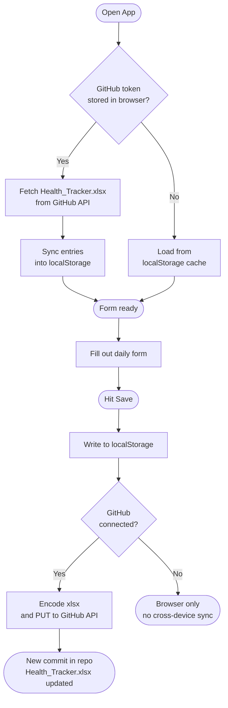
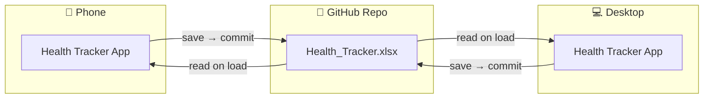
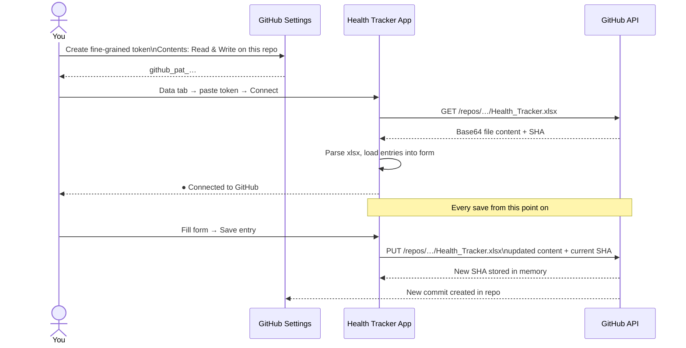
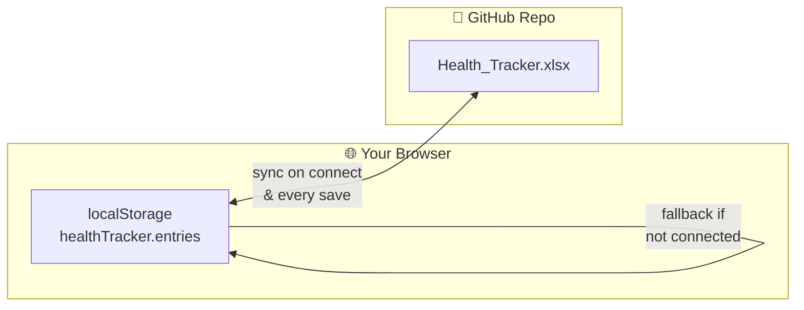

# Health Tracker

A Google-Forms-style daily health logging web app hosted free on **GitHub Pages**. Fill it out on desktop or phone — data commits directly to this repo as an Excel file.

## Features

- Daily form: weight, fasting blood sugar, meals (carbs + protein), snacks, had a drink, meds taken, exercise
- Cards auto-collapse after saving so the form stays clean — tap the header to expand any section
- Dark mode by default with a light/dark toggle in the header
- History view with expandable detail, edit, and delete
- Stats: 7-day and 30-day averages, weight and fasting BG trend charts
- GitHub sync: every save commits `Health_Tracker.xlsx` directly to this repo
- Browser localStorage used as offline cache and fallback
- CSV / JSON export and import
- Works on any browser, any device — add to home screen for an app-like experience

## Live app

```
https://kolec94.github.io/Health_tracker/
```

## Project files

```
Health_tracker/
├── index.html           ← markup and tab structure
├── styles.css           ← theming (CSS variables for dark/light mode)
├── app.js               ← all logic, storage, GitHub sync
├── Health_Tracker.xlsx  ← the database (written by the app on every save)
├── .nojekyll            ← tells GitHub Pages to serve files as-is
└── README.md            ← this file
```

---

## Architecture

### Data flow — save cycle



### Multi-device sync



### GitHub token setup



---

## GitHub sync setup

### 1 — Create a Personal Access Token

1. Go to **github.com → Settings → Developer settings → Personal access tokens → Fine-grained tokens**
2. Click **Generate new token**
3. Set **Resource owner** to your account
4. Under **Repository access**, select **Only select repositories** → choose this repo
5. Under **Permissions → Repository permissions**, set **Contents** to **Read and write**
6. Generate and copy the token

### 2 — Connect in the app

1. Open the app and go to the **Data** tab
2. Paste your token into the **GitHub sync** field and click **Connect**
3. The app reads any existing data from `Health_Tracker.xlsx` and loads it
4. Every save from now on commits the updated file to the repo

The token is stored in your browser only — it is never written to the repo. On page reload the app auto-reconnects silently using the stored token.

### Using on multiple devices

Repeat step 2 on each device (phone, second computer, etc.) — paste the same token once per browser. All devices share the same data through the repo file.

> **Note:** If two devices save at almost exactly the same time, the second save will show a toast error ("Failed: sha"). Just hit Save again — it will re-read the latest file and succeed.

---

## GitHub Pages setup

If you fork this repo and want to host your own copy:

1. Go to **Settings → Pages** in your repo
2. Under **Source**, pick **Deploy from a branch**
3. Branch: `main`, folder: `/ (root)` → **Save**
4. Your app will be live at `https://<your-username>.github.io/<your-repo-name>/` within a minute

---

## Using the app

| Tab | What it does |
|---|---|
| **Add entry** | Fill out the daily form. Cards collapse after saving — tap any header to expand. Re-opening the same date reloads the saved entry for editing. |
| **History** | Most recent first. Tap a row to expand → **Edit** loads it back into the form, **Delete** removes it. |
| **Stats** | Auto-updating averages for the last 7 and 30 days, plus weight and fasting BG trend charts. |
| **Data** | GitHub sync connection, CSV/JSON export and import, and the danger-zone wipe button. |

---

## Where is my data?



**Primary:** `Health_Tracker.xlsx` in this repo (when GitHub sync is connected).

**Cache / fallback:** Browser `localStorage` under the key `healthTracker.entries`. The app writes to both on every save. If you go offline or disconnect GitHub sync, the app continues working from the local cache.

---

## Customizing

- **Colors / theme:** Edit the CSS variables at the top of `styles.css`. The `:root` block controls light mode, `[data-theme="dark"]` controls dark mode.
- **Meal colors:** The colored left bars on meal cards are set by `.meal-breakfast::before`, `.meal-lunch::before`, etc. in `styles.css`.
- **Units:** Labels are in `index.html` — values are stored as plain numbers, no conversion is applied. Edit the suffix spans to switch to kg or mmol/L.
- **New field:** Add it to (1) the form in `index.html`, (2) the `FIELDS` array in `app.js`, (3) `entriesToRows` / `rowsToEntries` in `app.js` for xlsx sync, and (4) the CSV export headers.

---

## License

Personal project — use it however you like.
